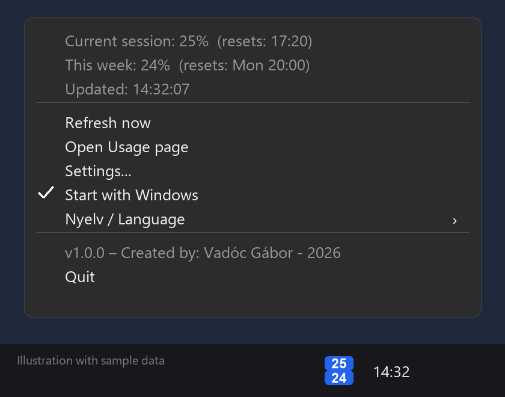

# Claude Usage Tray

> **A tiny Windows system-tray app that shows your claude.ai _current session_ and _weekly_ usage limits at a glance.** Unofficial · free · open source · English & Hungarian UI.
>
> **Egy apró Windows tálcaprogram, ami egy pillantással mutatja a claude.ai munkamenet- és heti használati korlátodat.**

<p align="center"></p>

<p align="center"><a href="../../releases/latest"><b>⬇ Download / Letöltés</b></a></p>

**🇭🇺 Magyar** · [🇬🇧 English below](#-english)

---

## 🇭🇺 Magyar

Kis Windows tálcaprogram, ami a **claude.ai** előfizetésed **Current session** és **This week** használati százalékát mutatja a tálcaikonon, folyamatosan frissítve.

### Funkciók

- Az ikon két színes sávból áll: felül a Current session, alul a heti százalék (vagy egyetlen számos mód).
- Színek: kék 70% alatt, narancs 70% felett, piros 90% felett.
- Az egérmutatót az ikon fölé víve megjelenik mindkét érték.
- Jobb gombos menü: visszaállítási időpontok (helyi idő), „Frissítés most", Usage oldal megnyitása, **Nyelv / Language** (magyar vagy angol), Kilépés.
- Kétnyelvű (magyar/angol) felület: a nyelv a jobb gombos menüből váltható, a választás megmarad (`settings.json`). Első indításkor a Windows nyelvét követi.
- Beállítható frissítési időköz (alapból 60 mp).
- Hiba esetén az utolsó jó értéket mutatja, és jelzi a problémát.
- Beépített beállító ablak (org_id, sessionKey), titkosított kulcstárolás, egypéldányos futás.
- Jobb gombos menüből kapcsolható automatikus indítás a Windows indulásakor.

### Telepítés (ajánlott)

1. Töltsd le a legfrissebb `ClaudeUsageTray-Setup-x.y.z.exe` telepítőt a [Releases](../../releases) oldalról.
2. Futtasd: a program a `Program Files` mappába települ (Start menü parancsikon, opcionális asztali ikon és **indítás a Windows-szal**).
3. Első indításkor megnyílik a **Beállítások** ablak: add meg az `org_id`-t és a `sessionKey`-t, a **Kipróbálás** gombbal ellenőrizheted, majd **Mentés**. (Később is elérhető: jobb klikk a tálcaikonra → **Beállítások...**)
4. Az automatikus indítás a jobb gombos menüben bármikor ki/bekapcsolható: **Indítás a Windows-szal**.

A `ClaudeUsageTray.exe` telepítő nélkül is futtatható (portable). A beállítások a `%APPDATA%\ClaudeUsageTray` mappába kerülnek, a `sessionKey` **titkosítva (Windows DPAPI)**, csak a te Windows-fiókodból olvasható vissza.

### Futtatás forrásból / fejlesztés

Követelmény: Python 3.9+.

```
pip install -r requirements.txt
python claude_usage_tray.py
```

Exe és telepítő építése: `build.bat` (PyInstaller + [Inno Setup 6](https://jrsoftware.org/isinfo.php)) → `dist\ClaudeUsageTray.exe`, `installer\ClaudeUsageTray-Setup-1.0.0.exe`.

A forrásból futtatott változat a `config.json`-t a script mellett keresi (lásd `config.example.json`), de a Beállítások ablak itt is használható.

### Az `org_id` és a `session_key` megszerzése

1. Nyisd meg a <https://claude.ai/settings/usage> oldalt a böngészőben.
2. Nyomd meg az **F12**-t → **Network** fül → szűrő: **Fetch/XHR** → frissítsd az oldalt.
3. Keresd meg a `usage` nevű kérést. A kérés URL-je így néz ki:
   `https://claude.ai/api/organizations/<org_id>/usage` – az `<org_id>` a szervezeti azonosító.
4. A `session_key`: **Application** fül → **Cookies** → `https://claude.ai` → `sessionKey` (értéke `sk-ant-sid...` kezdetű).

### ⚠️ Biztonság

- A `sessionKey` süti **lényegében a jelszavad**: aki ismeri, be tud lépni a fiókodba. **Soha ne töltsd fel a `config.json`-t** (a `.gitignore` ezt megakadályozza), és ne ossz meg fejlécmásolatokat/képernyőképeket, amelyekben a süti látszik.
- Ha kiszivárgott, jelentkezz ki az összes eszközről (Claude → Settings → Account), így a süti érvénytelen lesz.
- A süti idővel lejárhat; ilyenkor az ikon „!" jelet mutat, és a `session_key` értékét frissíteni kell.

### Korlátok és jogi nyilatkozat

- **Nem hivatalos projekt**, nincs kapcsolatban az Anthropic-kal.
- A program a claude.ai webes felülete által használt **nem dokumentált, belső végpontot** hívja. Ezt az Anthropic bármikor módosíthatja vagy megszüntetheti, ilyenkor a program nem fog működni.
- A claude.ai felhasználási feltételeinek betartása a te felelősséged. A használat saját felelősségre történik, garancia nélkül.
- Ha a Cloudflare blokkolja a kéréseket (`HTTP 403`), próbáld meg beírni a `cf_clearance` sütit is.

### Hibaelhárítás

| Tünet | Megoldás |
|---|---|
| `TypeError: unsupported operand type(s) for \|` | Régi Python; használd a legfrissebb verziót a repóból, vagy frissíts Python 3.9+-ra |
| `ModuleNotFoundError` | `pip install -r requirements.txt` |
| Szürke „!" ikon, `HTTP 401/403` | Lejárt `session_key`, vagy add meg a `cf_clearance`-t |
| `Ismeretlen válaszformátum` | Az Anthropic megváltoztatta a végpont szerkezetét |

---

## 🇬🇧 English

A small Windows system-tray app that shows your **claude.ai** subscription's **Current session** and **This week** usage percentages in the tray icon, refreshed continuously.

### Features

- The icon has two coloured bars: current session on top, weekly usage below (or a single-number mode).
- Colours: blue below 70%, orange from 70%, red from 90%.
- Hover over the icon to see both values in the tooltip.
- Right-click menu: reset times (local time), "Refresh now", open the Usage page, **Nyelv / Language** (Hungarian or English), Quit.
- Bilingual (Hungarian/English) UI: switch the language from the right-click menu; the choice is remembered (`settings.json`). On first run it follows the Windows UI language.
- Configurable refresh interval (default 60 s).
- On errors it keeps showing the last good value and flags the problem.
- Built-in settings window (org_id, sessionKey), encrypted key storage, single instance.
- Autostart with Windows, toggled from the right-click menu.

### Installation (recommended)

1. Download the latest `ClaudeUsageTray-Setup-x.y.z.exe` from the [Releases](../../releases) page.
2. Run it: the app installs to `Program Files` (Start menu shortcut, optional desktop icon and **start with Windows**).
3. On first launch the **Settings** window opens: enter your `org_id` and `sessionKey`, use **Test** to verify, then **Save**. (Available later via right-click on the tray icon → **Settings...**)
4. Autostart can be toggled any time from the right-click menu: **Start with Windows**.

`ClaudeUsageTray.exe` also runs standalone (portable). Settings are stored in `%APPDATA%\ClaudeUsageTray`; the `sessionKey` is **encrypted (Windows DPAPI)** and can only be read back from your own Windows account.

### Running from source / development

Requires Python 3.9+.

```
pip install -r requirements.txt
python claude_usage_tray.py
```

Build the exe and installer with `build.bat` (PyInstaller + [Inno Setup 6](https://jrsoftware.org/isinfo.php)) → `dist\ClaudeUsageTray.exe`, `installer\ClaudeUsageTray-Setup-1.0.0.exe`.

When run from source, the app reads `config.json` next to the script (see `config.example.json`); the Settings window works there too.

### Finding `org_id` and `session_key`

1. Open <https://claude.ai/settings/usage> in your browser.
2. Press **F12** → **Network** tab → filter **Fetch/XHR** → reload the page.
3. Find the request named `usage`. Its URL looks like
   `https://claude.ai/api/organizations/<org_id>/usage` – that's your organization ID.
4. For `session_key`: **Application** tab → **Cookies** → `https://claude.ai` → `sessionKey` (starts with `sk-ant-sid...`).

### ⚠️ Security

- The `sessionKey` cookie is **effectively your password**: anyone who has it can sign in to your account. **Never commit `config.json`** (the `.gitignore` prevents this) and never share header dumps or screenshots that reveal the cookie.
- If it leaks, log out of all devices (Claude → Settings → Account) to invalidate it.
- The cookie may expire over time; the icon then shows a "!" and you need to update `session_key`.

### Limitations & disclaimer

- **Unofficial project**, not affiliated with Anthropic.
- It calls an **undocumented, internal endpoint** used by the claude.ai web UI. Anthropic may change or remove it at any time, which would break this app.
- Compliance with claude.ai's terms of service is your responsibility. Use at your own risk, no warranty.
- If Cloudflare blocks the requests (`HTTP 403`), try adding the `cf_clearance` cookie as well.

### Troubleshooting

| Symptom | Fix |
|---|---|
| `TypeError: unsupported operand type(s) for \|` | Old Python; use the latest script from this repo or upgrade to Python 3.9+ |
| `ModuleNotFoundError` | `pip install -r requirements.txt` |
| Grey "!" icon, `HTTP 401/403` | Expired `session_key`, or provide `cf_clearance` |
| `Ismeretlen válaszformátum` (unknown response format) | Anthropic changed the endpoint's response structure |

---

## License / Licenc

MIT – see [LICENSE](LICENSE).

Készítette / Created by: **Vadóc Gábor** – 2026
