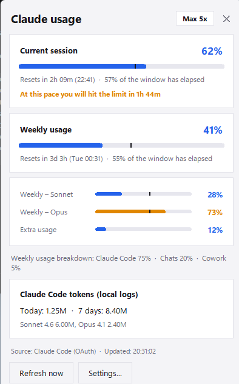

# Claude Usage Tray

> **A Windows tray app that shows your claude.ai _current session_ and _weekly_ usage limits at a glance.** Unofficial · free · open source · English & Hungarian UI.
>
> **Windows tálcaprogram, ami egy pillantással mutatja a claude.ai munkamenet- és heti használati korlátodat.**

<p align="center">
  
  &nbsp;&nbsp;
  
</p>

<p align="center"><a href="../../releases/latest"><b>⬇ Download / Letöltés</b></a></p>

**🇭🇺 Magyar** · [🇬🇧 English below](#-english)

---

## 🇭🇺 Magyar

### Mit tud

- **Két sávos tálcaikon:** felül a munkamenet (5 órás ablak), alul a heti használat. Kék 70% alatt, narancs 70% felett, piros 90% felett. Az ikon stílusa a menüből váltható (két sáv / csak munkamenet / csak heti).
- **Részletek ablak** (bal kattintás az ikonra): munkamenet, heti, **modellenkénti** (Sonnet, Opus) és extra használat, visszaállásig hátralévő idő, **tempójelző** (az időablak hány százaléka telt el) és **előrejelzés**, hogy ilyen tempóval mikor éred el a limitet. Világos/sötét módot a Windows beállítását követi.
- **Értesítések** 80 / 90 / 100%-nál, **tempó-előrejelzés** és visszaállási értesítés. Ablakonként egyszer jelez, nincs ismétlődő zaj (hiszterézis).
- **Claude Code tokenstatisztika** a helyi naplókból: ma és az elmúlt 7 nap, modellenként.
- **Két hitelesítési mód** (a Beállításokban):
  - **Claude Code bejelentkezés (OAuth):** nem kell semmit megadni, ha be vagy jelentkezve a Claude Code-ba.
  - **claude.ai süti** (`sessionKey` + `org_id`): ha nem használsz Claude Code-ot.
  - **Automatikus:** OAuth, ha van, különben süti.
- **Telepítővel vagy telepítés nélkül:** `Program Files`-ba települő telepítő, indítás a Windows-szal (menüből is kapcsolható), egypéldányos futás.
- Kétnyelvű (magyar/angol) felület, a Windows nyelvét követi, menüből váltható.
- Hiba esetén az utolsó jó értéket mutatja, és jelzi, hogy az adat régi. Rate limit (429) esetén a `Retry-After` szerint vár.

### Telepítés

1. Töltsd le a legfrissebb `ClaudeUsageTray-Setup-x.y.z.exe` telepítőt a [Releases](../../releases) oldalról (vagy a telepítés nélküli `ClaudeUsageTray.exe`-t).
2. Futtasd. Az első indításkor a **Beállítások** ablak nyílik meg, ha nem található Claude Code bejelentkezés.
3. A tálcaikon jobb gombos menüjében érhető el minden: Részletek, Beállítások, Indítás a Windows-szal, Értesítések, Frissítési időköz, Ikon stílusa, Nyelv.

> Az exe nincs digitálisan aláírva, ezért a Windows SmartScreen figyelmeztethet („További információ → Futtatás mindenképp”). A kiadásnál megadjuk a fájlok SHA256-összegét, és a forráskód teljesen nyílt.

### Melyik hitelesítési módot válaszd?

| | OAuth (Claude Code) | claude.ai süti |
|---|---|---|
| Beállítás | semmi, ha be vagy jelentkezve | `org_id` + `sessionKey` kézzel |
| Szükséges | telepített, bejelentkezett Claude Code | claude.ai fiók |
| Munkamenet, heti, modellenkénti, extra használat | ✔ | ✔ |
| Csomagnév (Pro / Max) | ✔ | – |
| Termékenkénti heti megoszlás (Claude Code / Chat / Cowork) | ha a végpont adja | ✔ (ha a válasz tartalmazza) |
| Lejárat | a token lejár; nyisd meg a Claude Code-ot, és megújul | a süti idővel lejár, újra be kell másolni |

A program az OAuth-tokent **csak olvassa**, soha nem frissíti: azt a Claude Code kezeli, és a forgatás kijelentkeztethetné onnan.

### Az `org_id` és a `sessionKey` megszerzése (süti mód)

1. Nyisd meg a <https://claude.ai/settings/usage> oldalt a böngészőben.
2. **F12** → **Network** → szűrő: **Fetch/XHR** → frissítsd az oldalt.
3. Keresd a `usage` kérést; az URL-je `…/api/organizations/<org_id>/usage`. (A teljes URL-t be is illesztheted, a program kiveszi belőle az azonosítót.)
4. **Application** → **Cookies** → `https://claude.ai` → `sessionKey` (értéke `sk-ant-sid…`).

### Átláthatóság és adatvédelem

- **Hálózat:** a program csak az `api.anthropic.com` (OAuth mód) és a `claude.ai` (süti mód) felé kommunikál. A **„Frissítések keresése”** menüpont kattintásra az `api.github.com`-ot kérdezi le; ezen kívül nincs telemetria és nincs automatikus frissítés.
- **Mit ír a lemezre:** `%APPDATA%\ClaudeUsageTray\` mappába `config.json` (a kulcsok **Windows DPAPI-val titkosítva**, csak a te Windows-fiókodból olvashatók vissza), `settings.json` (beállítások), `claude_usage_tray.log` (napló, kulcsot soha nem tartalmaz), és az **Indítás a Windows-szal** kapcsolóhoz egy `HKCU\…\Run` bejegyzés.
- **Helyi napló:** a tokenstatisztikához a `~/.claude/projects` JSONL fájljait olvassa (csak olvassa). Csak a Claude Code forgalmát látja, a claude.ai csevegést nem.
- A `sessionKey` süti **lényegében a jelszavad**: ne oszd meg, és képernyőképen se mutasd. Ha kiszivárgott, jelentkezz ki az összes eszközről (Claude → Settings → Account).

### Korlátok és jogi nyilatkozat

- **Nem hivatalos projekt**, nincs kapcsolatban az Anthropic-kal.
- Mindkét mód **nem dokumentált, belső végpontot** használ, amit az Anthropic bármikor módosíthat vagy megszüntethet; ilyenkor a program nem fog működni (a hiba „Ismeretlen válaszformátum”).
- Az előfizetéses OAuth-token vagy a böngészősüti harmadik fél programjában való használata ütközhet a szolgáltatás feltételeivel. A használat saját felelősségre történik, garancia nélkül.
- Ha a Cloudflare blokkol (`HTTP 403`), süti módban add meg a `cf_clearance` sütit is.

### Hibaelhárítás

| Tünet | Megoldás |
|---|---|
| „A Claude Code bejelentkezése nem található” | Jelentkezz be a Claude Code-ba, vagy válaszd a süti módot |
| „A Claude Code tokenje lejárt” | Nyisd meg a Claude Code-ot, a token megújul, majd **Frissítés most** |
| `HTTP 401/403` süti módban | Lejárt `sessionKey`, vagy add meg a `cf_clearance`-t |
| „Túl sok kérés” | Rate limit: a program magától újrapróbálja; növeld a frissítési időközt |
| „Ismeretlen válaszformátum” | Az Anthropic megváltoztatta a végpontot |
| Szürke „!” ikon | Még nincs adat vagy bejelentkezés |

### Fejlesztés

Követelmény: Python 3.9+.

```
pip install -r requirements.txt
python claude_usage_tray.py          # futtatás forrásból
python -m unittest discover tests    # tesztek
build.bat                            # exe + telepítő (PyInstaller + Inno Setup 6)
```

Szerkezet: a `claude_usage/` csomag moduljai: `sources.py` (adatforrások), `insights.py` (tempó, előrejelzés, értesítések), `localstats.py` (tokenstatisztika), `app.py` (tálca), `ui_*.py` (ablakok), `i18n.py` (szövegek). Forrásból futtatva a beállítások a projektmappába kerülnek.

---

## 🇬🇧 English

### Features

- **Two-bar tray icon:** session (5-hour window) on top, weekly usage below. Blue under 70%, orange from 70%, red from 90%. Icon style is switchable (two bars / session only / weekly only).
- **Details flyout** (left-click the icon): session, weekly, **per-model** (Sonnet, Opus) and extra usage, time until reset, a **pace marker** (how much of the window has elapsed) and a **forecast** of when you will hit the limit at the current rate. Follows the Windows light/dark setting.
- **Notifications** at 80 / 90 / 100%, a **pace forecast** alert and a reset alert. Each fires once per window, no repeated noise (hysteresis).
- **Claude Code token statistics** from local logs: today and the last 7 days, per model.
- **Two authentication modes** (in Settings):
  - **Claude Code sign-in (OAuth):** nothing to enter if you are signed in to Claude Code.
  - **claude.ai cookie** (`sessionKey` + `org_id`): if you do not use Claude Code.
  - **Automatic:** OAuth if available, otherwise cookie.
- **Installer or portable:** installs to `Program Files`, start with Windows (also toggled from the menu), single instance.
- Bilingual (Hungarian/English) UI, follows the Windows language, switchable from the menu.
- On errors it keeps the last good value and flags it as stale. On rate limits (429) it honours `Retry-After`.

### Installation

1. Download the latest `ClaudeUsageTray-Setup-x.y.z.exe` from [Releases](../../releases) (or the portable `ClaudeUsageTray.exe`).
2. Run it. On first launch the **Settings** window opens if no Claude Code sign-in is found.
3. Everything is in the tray icon's right-click menu: Details, Settings, Start with Windows, Notifications, Refresh interval, Icon style, Language.

> The exe is not code-signed, so Windows SmartScreen may warn you ("More info → Run anyway"). SHA256 checksums are published with each release and the source is fully open.

### Which authentication mode?

| | OAuth (Claude Code) | claude.ai cookie |
|---|---|---|
| Setup | none if signed in | enter `org_id` + `sessionKey` |
| Requires | installed, signed-in Claude Code | claude.ai account |
| Session, weekly, per-model, extra usage | ✔ | ✔ |
| Plan name (Pro / Max) | ✔ | – |
| Weekly split by product (Claude Code / Chat / Cowork) | if the endpoint returns it | ✔ (when present in the response) |
| Expiry | token expires; open Claude Code and it renews | cookie expires, paste a new one |

The OAuth token is **only read**, never refreshed: Claude Code owns it, and rotating it could sign you out there.

### Finding `org_id` and `sessionKey` (cookie mode)

1. Open <https://claude.ai/settings/usage> in your browser.
2. **F12** → **Network** → filter **Fetch/XHR** → reload.
3. Find the `usage` request; its URL is `…/api/organizations/<org_id>/usage`. (You can paste the whole URL, the app extracts the id.)
4. **Application** → **Cookies** → `https://claude.ai` → `sessionKey` (starts with `sk-ant-sid…`).

### Transparency & privacy

- **Network:** the app talks only to `api.anthropic.com` (OAuth mode) and `claude.ai` (cookie mode). The **"Check for updates"** menu item queries `api.github.com` when clicked; there is no telemetry and no automatic update.
- **Files written:** `%APPDATA%\ClaudeUsageTray\` holds `config.json` (keys **encrypted with Windows DPAPI**, readable only from your Windows account), `settings.json` (preferences) and `claude_usage_tray.log` (never contains keys), plus an `HKCU\…\Run` entry for **Start with Windows**.
- **Local logs:** token statistics read (read-only) the JSONL files in `~/.claude/projects`. They only cover Claude Code, not claude.ai chats.
- The `sessionKey` cookie is **effectively your password**: do not share it or show it in screenshots. If it leaks, sign out of all devices (Claude → Settings → Account).

### Limitations & disclaimer

- **Unofficial project**, not affiliated with Anthropic.
- Both modes use an **undocumented internal endpoint** that Anthropic may change or remove at any time, which would break the app (the error is "Unknown response format").
- Using a subscription OAuth token or a browser cookie in a third-party app may conflict with the service's terms. Use at your own risk, no warranty.
- If Cloudflare blocks the request (`HTTP 403`), add the `cf_clearance` cookie in cookie mode.

### Troubleshooting

| Symptom | Fix |
|---|---|
| "Claude Code sign-in not found" | Sign in to Claude Code, or choose the cookie mode |
| "The Claude Code token expired" | Open Claude Code so it renews the token, then **Refresh now** |
| `HTTP 401/403` in cookie mode | Expired `sessionKey`, or add `cf_clearance` |
| "Rate limited" | The app retries automatically; increase the refresh interval |
| "Unknown response format" | Anthropic changed the endpoint |
| Grey "!" icon | No data or sign-in yet |

### Development

Requires Python 3.9+.

```
pip install -r requirements.txt
python claude_usage_tray.py          # run from source
python -m unittest discover tests    # tests
build.bat                            # exe + installer (PyInstaller + Inno Setup 6)
```

Layout: the `claude_usage/` package: `sources.py` (data sources), `insights.py` (pace, forecast, alerts), `localstats.py` (token stats), `app.py` (tray), `ui_*.py` (windows), `i18n.py` (strings). When run from source, settings live in the project folder.

---

## Credits / Köszönet

Ideas and lessons from similar open-source projects: pace markers and time-aware alerts ([usage-monitor-for-claude](https://github.com/jens-duttke/usage-monitor-for-claude)), burn-rate forecast and re-armed alerts ([Tray-Usage-Monitor](https://github.com/Firnschnee/Tray-Usage-Monitor)), request safeguards and no token refresh ([claude-usage-tray](https://github.com/apexlocal-jz/claude-usage-tray)), local token statistics ([claude_ai_usage_widget](https://github.com/StaticB1/claude_ai_usage_widget), [ClaudeBar](https://github.com/daybigo/ClaudeBar)), Credential Manager lookup and honest stale-data handling ([ClaudeTracker](https://github.com/TobiiNT/ClaudeTracker), [ai-usage](https://github.com/wojtekmaj/ai-usage)). Everything here is an independent implementation.

## License / Licenc

MIT – see [LICENSE](LICENSE).

Készítette / Created by: **Vadóc Gábor** – 2026
